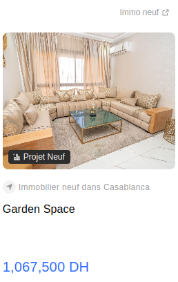

# Scraping Module

Web scraping is our go-to technique for collecting data from different real estate platforms.

We are focusing on collecting data about appartments on sale throughout Morocco.

The main platforms used for data collection are:

- [Avito](https://www.avito.ma/)
- [Mubawab](https://www.mubawab.ma/)
- [Sarouty](https://www.sarouty.ma/)
- [Yakeey](https://yakeey.com/fr-ma)

The following is a description regarding practices and rules we followed while scraping data, as well as the limitations and challenges faced for each platform.

## Avito

[Avito](https://www.avito.ma/) is a large marketplace that provide a wide range of products in every category. But as real estate is a very large category on its own, the platform dedicated resources made specifically for this class of products.

In our case, we are going to be looking at [appartments for sale](https://www.avito.ma/fr/maroc/appartements-%C3%A0_vendre), which currently contains more than 47k annoucements, making it our biggest data source.

### Description

- Each page contains about 44 announcements, with more than 1400 pages.
- For each page, we can easily extract the link to each announcement, and then extract the information we need from each announcement page.
- Here's a list of what an announcement page contains:
  - Title (required)
  - City (required)
  - Time of publication (automatically set by the platform)
  - Number of bedrooms (required - 1 -> 11)
  - Description (required)
  - Type (required - "Appartements, à vendre" in our case)
  - Neighborhood (required)
  - Living area (required)
  - Floor (required)
  - Price (optional - "Prix non spécifié" if not provided)
  - Number of bathrooms (optional - 0 -> 8)
  - Total area (optional)
  - Number of living rooms (optional - 0 -> 8)
  - Age (optional)
  - Adress (optional)
  - Syndicate price (optional)
  - Equipments (optional - list of predefined values: "Balcon", "Ascenseur", "Terrasse",  "Meublé", "Climatisation", "Chauffage", "Cuisine équipée", "Concierge", "Sécurité", "Parking", "Duplex", "Câblage téléphonique")
- A page is estimated to take about 5 seconds to be scraped.

### Rules

- The [robots.txt](https://www.avito.ma/robots.txt) file doesn't seem to contain rules that forbid the use of automated bots for retrieving data. However, considering the large ammount of data to be collected, we have to be very careful not to disturb the traffic.

### Challenges

- Huge number of requests to be made.
- Premium announcements are JavaScript rendered (2 per page).
- Description is not fully displayed, and requires a click to be shown.
- Retrieving Javascript rendered attributes, such as the number of rooms, bathrooms, etc (represented by icons):

- Some announcement links redirect to external websites:

### Suggestions

- We can combine Avito's scrapper with the others, and running them in a way that makes requests split across the platforms, in order to give each platform a resting time.
- Fortunately, we can extract this information from the announcements list page, as the information is displayed directly there and it is easier to process it. Here's how the information is displayed:

- We can easily distinguish between internal and external websites (scrapy does this automatically via the allowed_domains attribute of the scrapper), making it easy to ignore those external redirections.

## Tests

After navigating through the pages and announcements, we have come up with different cases against which we need to test our scrapper, the three main set of tests we need to have are:

- Retrieving all of the listed announcements from a page.
- Extracting all of the required as well as the optional information from an announcement page.
- Navigating through the pages.

For this, we have created a test file at `../tests/scraping/avito.py`.

- There are 3 types of announcements:
  - Regular announcement
  - Star announcement
  - External announcement
  - (Note that there are also premium announcements which are out of the scope of this iteration as they require more discussions)

- There are 3 types of pages:
  - First page
  - Middle page
  - Last page

For simplicity, we have choosen the function based approach for testing, for easy setting up the tests. As we add more scrapers, we can move to class based testing.
